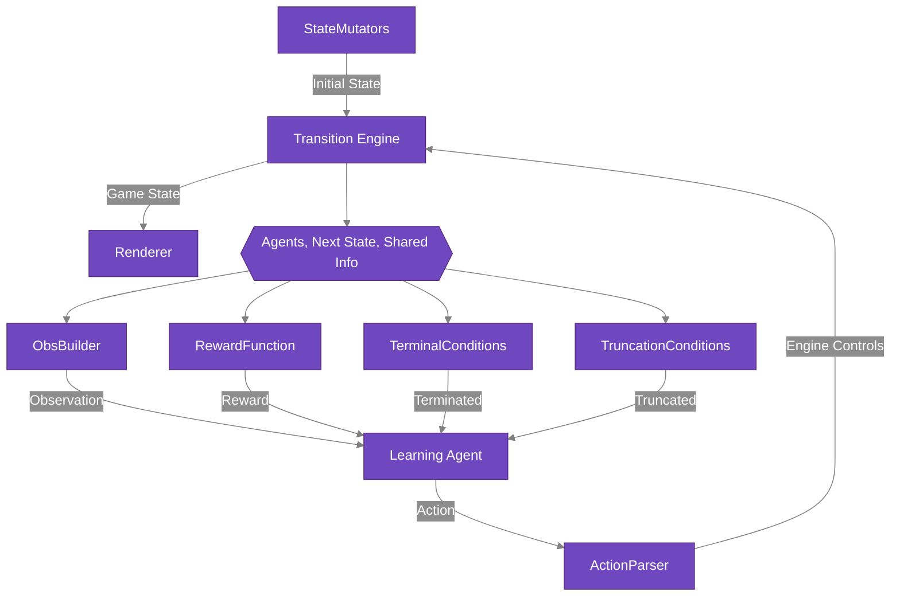

# Overview of RLGym

RLGym breaks down a reinforcement learning environment into a set of components, which we call "configuration objects." Every environment is defined by a set of these objects, and the RLGym API handles the flow of information between them to present a consistent interface for an agent to interact with. To create a new environment, users just need to implement each of the configuration objects described below and pass them to the `RLGym` constructor.

## Configuration Objects

There are a total of 6 required configuration objects, and an optional renderer. They are:
- A `TransitionEngine`: Handles how the environment changes from one state to another
- A `StateMutator`: Controls how the environment gets reset or modified
- An `ObsBuilder`: Turns the environment state into agent observations
- An `ActionParser`: Defines what actions agents can take
- A `RewardFunction`: Determines what rewards agents receive
- One or more `DoneConditions`: Decide when episodes should be terminated (natural end) or truncated (early stop)
- Optionally a `Renderer`: Shows you what's happening in the environment

The diagram below shows the interaction between these components:

To see an example of a concrete implementation of these configuration objects, see our [Custom Environment](../../Custom%20Environments/custom-environment) guide, or check out the individual examples relevant to Rocket League in our [Rocket League](../../Rocket%20League/Configuration%20Objects/action_parsers) section.