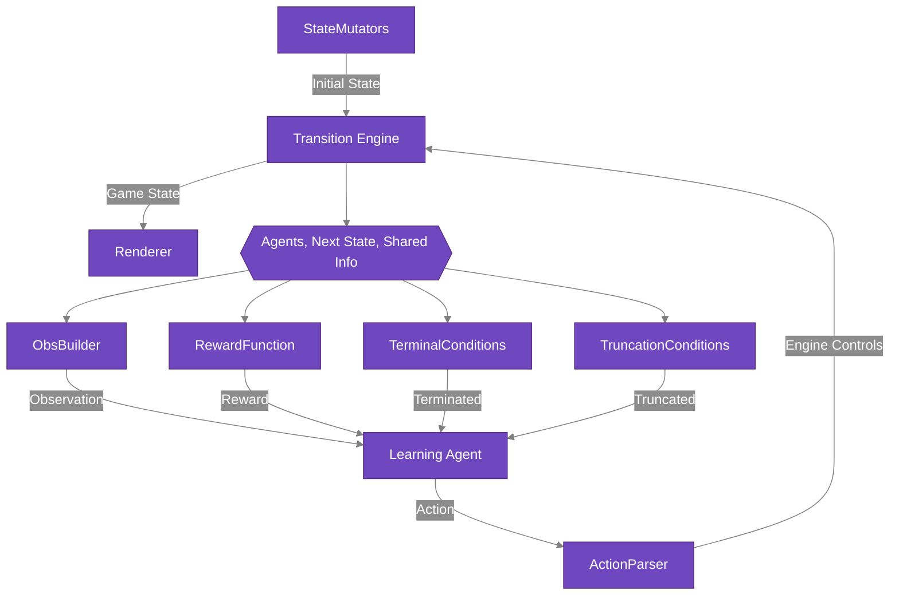

# Overview of RLGym

RLGym is designed to make creating and modifying reinforcement learning environments as simple as possible. The RLGym API breaks down an environment into several components, which we refer to as "configuration objects". All a user needs to do to create their own environment is write a concrete implementation of the configuration objects they want to use, and RLGym will handle the rest. Our goal is to provide a clear path from asking the question "Is it possible to use reinforcement learning with this game?" to actually training an agent.

## Configuration Objects

Every RLGym environment is built from the following components, which we refer to as "configuration objects":
- A `TransitionEngine`: Manages state transitions and core environment logic
- A `StateMutator`: Controls how environment state is modified (e.g., on reset)
- An `ObsBuilder`: Converts environment state into agent observations
- An `ActionParser`: Defines and validates agent actions
- A `RewardFunction`: Calculates rewards for agent actions
- One or more `DoneConditions`: Determine when episodes end (termination) or are cut short (truncation)
- Optionally a `Renderer`: Visualizes the environment state

The diagram below depicts how RLGym configuration objects come together to define an environment and interface with
a learning agent.

To see an example of a concrete implementation of these configuration objects, see our [Custom Environment](../../Custom%20Environments/custom-environment) guide, or check out the individual examples relevant to Rocket League in our [Rocket League](../../Rocket%20League/Configuration%20Objects/action_parsers) section.