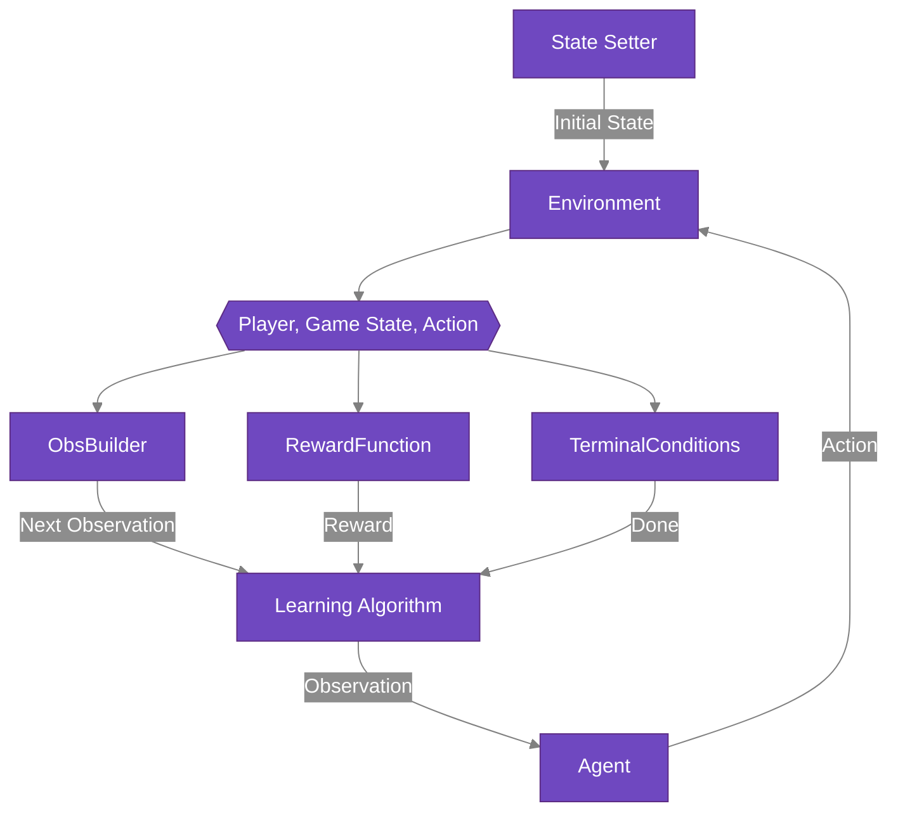

# Configuration Objects

At their core, RLGym environments are configured with 3 basic objects:

1. A [RewardFunction](https://rlgym.github.io/docs-page.html#reward-functions)
2. An [ObsBuilder](https://rlgym.github.io/docs-page.html#observation-builders)
3. A list of [TerminalCondition](https://rlgym.github.io/docs-page.html#terminal-conditions) objects

RLGym uses these objects at every step.

* To determine what reward should be assigned to each action.
* What observation should be returned to the agent.
* When an episode should be terminated.

The flowchart below depicts how each of these objects is used by RLGym.

RLGym comes with a few of these objects implemented out of the box to provide users with inspiration when creating their own.
The default configuration objects for any RLGym environment can be overridden by simply passing instances of a desired configuration object to the optional arguments of `make`.
