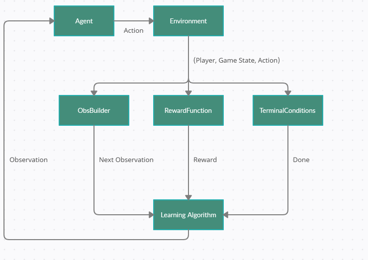

## Configuration Objects
At their core, RLGym environments are configured through 3 fundamental objects:
1. A [RewardFunction](https://rlgym.github.io/docs-page.html#reward-functions)
2. An [ObsBuilder](https://rlgym.github.io/docs-page.html#observation-builders)
3. A list of [TerminalCondition](https://rlgym.github.io/docs-page.html#terminal-conditions) objects

RLGym uses these 3 objects at every step to determine what reward should be assigned to each action, what observation should be returned to the agent, and when an episode should be terminated.
The flowchart below depicts how each of these objects is used by RLGym.



RLGym comes with a few of these objects implemented already to provide users with inspiration when creating their own. The default configuration objects for any RLGym environment can
be overridden by simply passing instances of a desired configuration object in the optional arguments of `make`. 

As an example, let's configure an environment that will put our agent in the field alone with the ball, and give it a reward for driving in the direction of the ball.
We'll give our agent 20 seconds from the start of an episode to drive toward the ball as fast as possible.
```python
import rlgym
from rlgym.utils.terminal_conditions.common_conditions import TimeoutCondition
from rlgym.utils.reward_functions.common_rewards import MoveTowardsBallReward
from rlgym.utils.obs_builders.advanced_obs import AdvancedObs

#The desired number of seconds we would like to wait before terminating an episode.
ep_len_seconds = 20

#By default, RLGym will repeat every action for 8 physics ticks before waiting for a new action from our agent.
default_tick_skip = 8

#The tick rate of the Rocket League physics engine.
physics_ticks_per_sec = 120

#Now we compute the number of calls to env.step() that need to happen for our desired amount of time to pass.
max_steps = int(round(ep_len_seconds * physics_ticks_per_sec / default_tick_skip))

timeout_condition = TimeoutCondition(max_steps)
reward_function = MoveTowardsBallReward()
obs_builder = AdvancedObs()
terminal_conditions = [timeout_condition,]

#All we have to do now is pass our custom configuration objects to rlgym!
env = rlgym.make("default",
                 spawn_opponents=False,
                 reward_fn=reward_function,
                 obs_builder=obs_builder,
                 terminal_conditions=terminal_conditions, 
                 tick_skip=tick_skip)
```
And just like that we have configured our custom environment! Any optional arguments that we didn't provide will remain at their defaults.

To learn more about each configuration object and how to implement your own, visit each of their respective [Tutorials](https://rlgym.github.io/docs-page.html#section-3)
